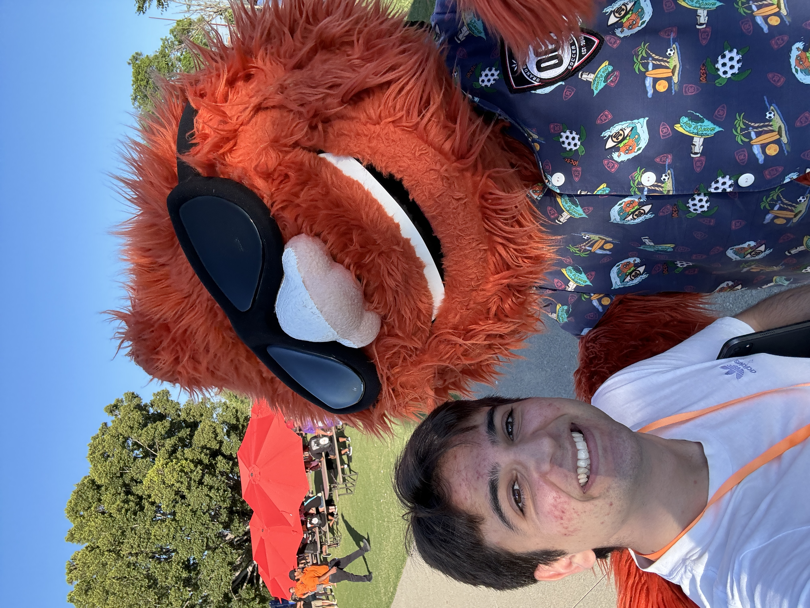
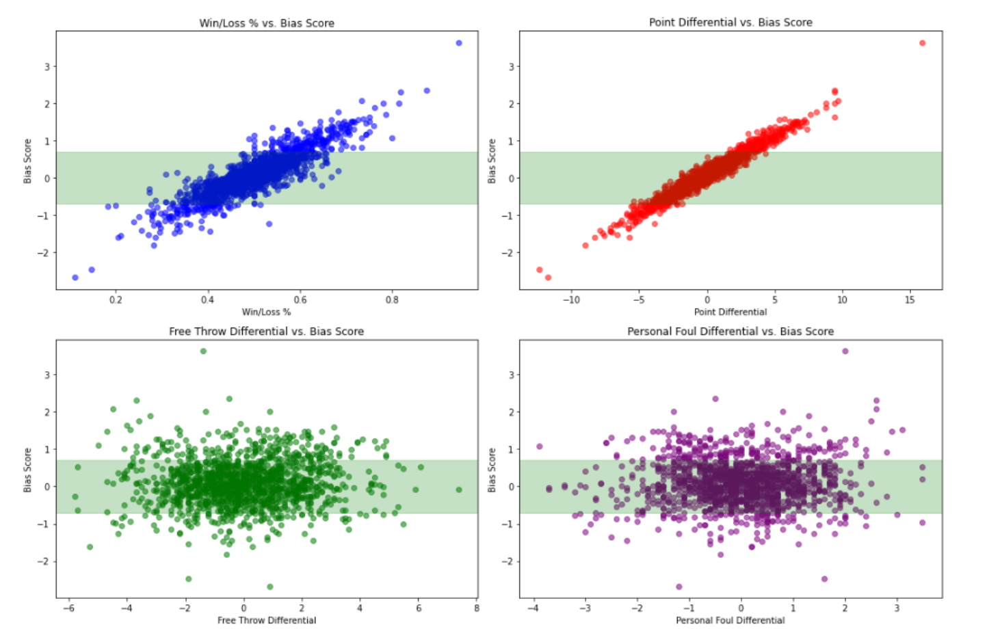
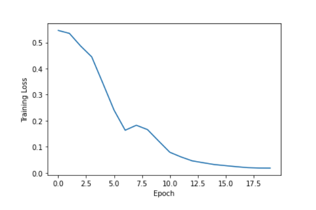
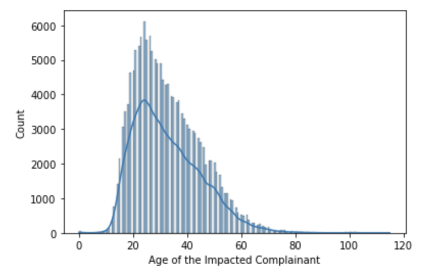
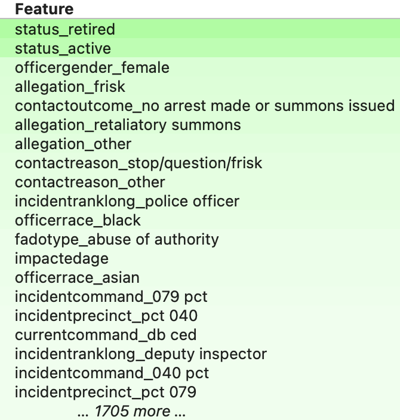
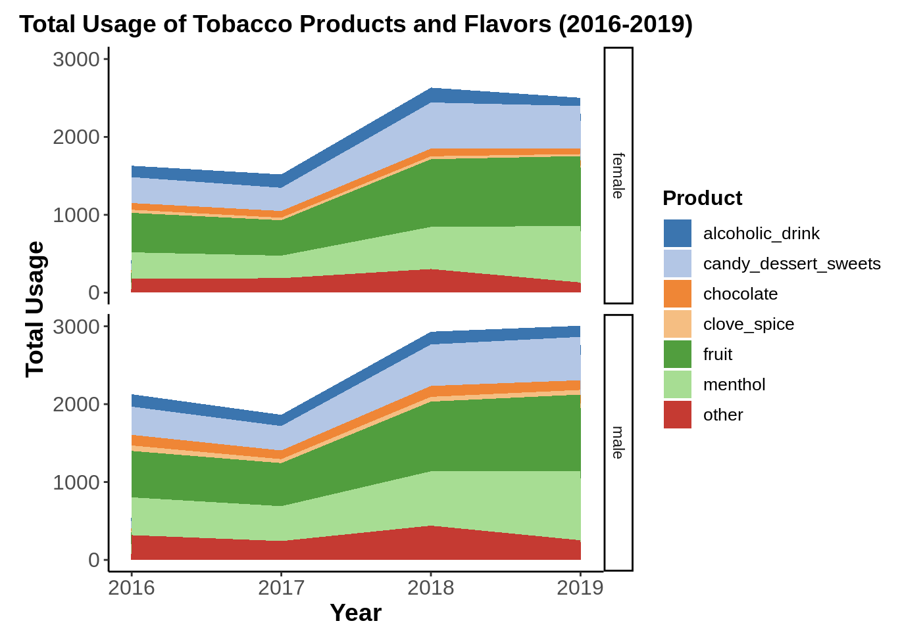
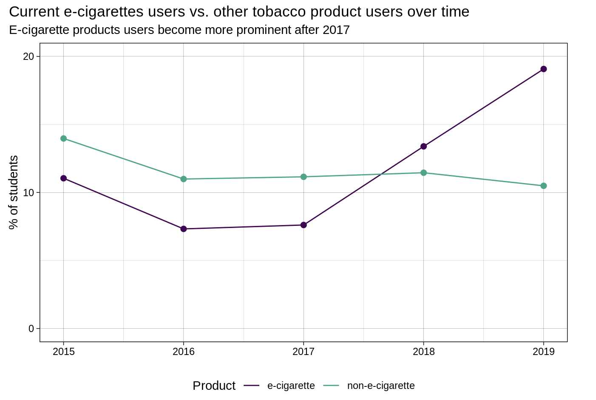

### About Me

At heart, I've always been a creative storyteller. As a child, I eagerly anticipated writing hour in class, valuing it as a time to explore my imagination and express myself without social fears. Simultaneously, my love for sports blossomed. At age 8, I became captivated by basketball, drawn to its emphasis on **precision** and **decision-making**. I marveled at the practice required for shooting accuracy and was fascinated by the **strategic** aspects of coaching and team management. Technology was another childhood passion. Though often denied the latest gadgets, I always researched how devices worked, viewing them as tools to enhance lives. These early interests would all converge later in unexpected ways.

Entering college at UC San Diego, I initially chose English as my "safe" major. However, I quickly realized this path didn't encompass all my passions and career goals. Feeling lost, I then discovered **Cognitive Science** and **Data Science**—fields that perfectly aligned with my diverse interests. Here, I could explore the cognition behind decision-making, learn about life-changing technologies like **machine learning and AI**, and apply these tools to projects tailored to **my passions**. Importantly, I could continue to express my **creativity** through data visualization and analytical writing.

After completing my Master's Degree in Data Science at UC Irvine, I stepped fully into the world I had been preparing for. Today, I work as an AI and machine learning engineer building real-world systems that connect human insight with advanced technology. Whether I'm developing LLM-powered tools, refining machine learning algorithms, or improving how people and data interact at scale, I’m driven by the same values I had as a child: curiosity, creativity, and precision.

From the quiet kid who loved writing and basketball to the builder of intelligent systems, each step in my journey has shaped how I think about data science. My work blends **analytical rigor** with creative insight and a passion for understanding complex systems. I aim not just to solve problems, but to reshape how we see and solve them—through a lens that connects human experience with technological innovation.

### Education

I hold a Master’s in Data Science from UC Irvine, and a Bachelor’s of Science in Machine Learning and Neural Computation from UC San Diego’s Cognitive Science department. Additionally, I earned a certification in Machine Learning Methods from UC San Diego Extension.

  
  

### Experience
#### **Scale AI - Generative Artificial Intelligence Prompt Engineer (November 2024 - Present):**

More info coming soon!

#### **Scale AI - Generative Artificial Intelligence Prompt Engineer (April 2024 - Present):**
I joined Scale AI as a freelance Gen AI Prompt Engineer in May 2024. By refining and training LLM responses, I've significantly improved the quality of AI-human interactions, boosting beta-specific satisfaction scores for a pre-release version of a **ChatGPT model** from **3.6 to 4.67 out of 5**. Leveraging regression modeling, I predicted user satisfaction scores from various conversation metrics, providing insights into user experience and reducing AI hallucinations by **30%** across multiple models. My proudest achievement was collaborating with OpenAI to analyze real-world ChatGPT 4 conversations, processing over **3 million data points**. Applying clustering techniques like **K-means** and **Hierarchical Agglomerative Clustering (HAC)**, I identified crucial user patterns such as query complexity and topic preferences. These strategies, combined with reinforcement learning techniques using human feedback on nearly 500,000 interactions, improved response relevancy and empathy ratings from **61% to 83%**. As a result, average user session duration increased from **8 to 13.5 minutes** across testing platforms, directly contributing to the advancement of future ChatGPT iterations.

**Tech Stack:** LLM Prompt Engineering, Regression Modeling, Sentiment Analysis, Clustering Techniques (K-means, HAC), Data Analysis, Machine Learning, Natural Language Processing

  

#### **MoodMe - Machine Learning Engineer & Co-Founder (December 2023 - October 2024):**
Revolutionizing emotional intelligence products across industries, I led the creation of unbiased emotion detection applications at MoodMe. I developed a novel text emotion detection model, powered by a fine-tuned version of **Hugging Face's BERT**, which became the backbone of our well-being diary application, EmotionTrack. This tool achieved an impressive **89% F1 score** in detecting emotions across 8 categories, helping users track and understand their emotional patterns over time and resulting in a **41% increase in user-reported emotional self-awareness** after two months of consistent use in beta testing. Through comprehensive benchmarking and analysis, I enhanced our in-house emotion models using **transfer learning, boosting, and noise injection techniques**. These improvements led to an immediate performance boost across all deployment platforms, increasing emotion detection accuracy from **75% to 91.5%**. Notably, we expanded our emotion detection training dataset from 3 to 7 major ethnic groups, enabling the development of more inclusive machine learning models. This crucial update increased overall accuracy across all demographics from **68% to 87% and reduced misclassification rates in underrepresented groups by 62%**, solidifying MoodMe's position in the emotional AI market.

**Tech Stack:** Machine Learning Model Development, BERT Fine-tuning, Emotion Detection, Benchmarking, Transfer Learning, Noise Injection, Computer Vision, Natural Language Processing

  
  <a href="MoodMe Benchmarks Jan 2024.pptx-4.pdf" class="btn" target="_blank" rel="noopener noreferrer">View Competitive Analysis Presentation</a>
  <a href="https://www.mood-me.com" class="btn" target="_blank" rel="noopener noreferrer">Visit MoodMe Website</a>

#### **Donald Bren School of ICS - Master of Data Science Ambassador (October 2023 - December 2024):**
As a Master of Data Science Ambassador for UC Irvine's Donald Bren School of Information and Computer Sciences, I connected prospective students with the program and served as an analyst. I contributed to marketing campaigns, provided insights to potential students, and conducted internal analyses with program directors. Using R's `forecast` library and Python's `statsmodels`, I performed time series analysis to track and predict trends in data science master's programs across the U.S. This analysis confirmed UCI's MDS as a top program in the country and identified growth areas, **informing curriculum and operational updates that increased program relevance in national rankings such as Forbes**. My project examining custom metrics across tech-centric master's programs, including transparency and flexibility scores, consistently ranked UC Irvine's MDS at the top, reinforcing its competitive edge in the field.

**Tech Stack:** Time Series Analysis, R Programming, Python Programming, Data Visualization, Market Research, Program Analysis, Communication, Student Outreach, Leadership, Teamwork

  

  
  <a href="Additional Program Analysis.html" class="btn" target="_blank" rel="noopener noreferrer">View Program Analysis Project</a>

#### **Sportradar US - Sports Data Operator (September 2022 - October 2024):**
As a Sports Data Operator for Sportradar, I've attended and recorded game-related statistics for over 250 NCAA and professional sporting events across four different sports: basketball, baseball, volleyball, and soccer. Using the company's mobile application, I've captured advanced game-related statistics in real-time, improving my data collection skills in high-pressure environments. I also improved on-site data collection efficiency by suggesting a UI modification within the basketball play-by-play logging workflow, reducing average input time per play from **8 seconds to 3 seconds**. My performance has consistently earned 5-star ratings, which has placed me as a **top data operator in the United States**. This experience has solidified my commitment to data-driven decision making and demonstrated my ability to excel in **fast-paced, accuracy-critical environments**.

**Tech Stack:** Real-time Data Collection, Sports Analytics, Statistical Analysis, Mobile Application Proficiency, Attention to Detail, Performance Metrics, Multi-sport Expertise, Data Accuracy and Consistency

  

### Projects
#### **Natural Language Financial Analytics on CEO Communication:**

I created this project to explore the relevant and hidden connections between CEO communication styles and financial performance. By diving deep into earnings call transcripts, I sought to unravel the subtle ways in which the words of leaders shape the trajectory of their companies. With the assistance of **natural language processing** and **machine learning**, I developed a comprehensive analysis pipeline that transformed raw text into meaningful numeric representations using text-to-numeric conversion (**TF-IDF**) and singular value decomposition (**SVD**). Through **correlation analysis** and **sentiment analysis**, I uncovered intriguing industry-specific relationships between the sentiments expressed in earnings calls and key financial metrics for companies like Apple and Lululemon. While no strong evidence of short-term causality emerged, the project highlighted distinct correlation patterns between sentiment and financial performance for the two companies. By emphasizing the importance of context-aware financial analysis, this project demonstrated how the impact of human communication on financial metrics can vary significantly across different corporate landscapes, and showed the profound influence of language on the pulse of the business world.

**Tech Stack:** Natural Language Processing (NLP), Machine Learning (ML), Text Preprocessing, Text-to-Numeric Conversion, TF-IDF, Singular Value Decomposition (SVD), Correlation Analysis, Sentiment Analysis, Statistical Testing, Data Visualization

  
  <a href="Sales Sentiment Project_ Apple vs Lululemon.pdf" class="btn" target="_blank" rel="noopener noreferrer">Project Presentation</a>
  <a href="https://github.com/sebastianalgharaballi/SalesSentiment" class="btn" target="_blank" rel="noopener noreferrer">Project GitHub Link</a>

#### **Autoencoder Anomaly Analysis for NBA Players:**

Inspired by the **Mamba Mentality** of my all-time favorite player, Kobe Bryant, I completed this project to analyze his legendary 2008-2009 NBA season. This project wasn't just about numbers; it was about understanding the **heart of a champion** through data. I developed a **custom autoencoder deep learning algorithm** using **PyTorch**, designed to detect statistical anomalies in Kobe's game-by-game performance. The model processed **20 advanced basketball metrics** across 100 games, including both regular season and playoffs. By implementing **Min-Max scaling** and carefully structuring the **neural network architecture** with ReLU and sigmoid activation functions, I created a strong system capable of capturing the nuances of Kobe's play. The autoencoder achieved **100% accuracy in identifying performance outliers**, effectively distinguishing between Kobe's average games and those spectacular moments that defined his career. This project not only showcased my technical skills in **deep learning** and **anomaly detection** but also demonstrated my ability to blend passion with precision – a trait I carry from Kobe's influence into every aspect of my data science work.

**Tech Stack:** Deep Learning, PyTorch, Autoencoder Architecture, Anomaly Detection, Data Preprocessing, Min-Max Scaling, Neural Network Design, Sports Analytics

  
  <a href="Kobe_Paper-2.pdf" class="btn" target="_blank" rel="noopener noreferrer">Project Research Paper</a>
  <a href="https://github.com/sebastianalgharaballi/KobeAnomalyAnalysis" class="btn" target="_blank" rel="noopener noreferrer">Project GitHub Link</a>

#### **Advanced NBA Referee Analysis:**

Growing up, I was amazed by the fast-paced excitement of NBA games, but I often found myself puzzled by controversial calls that seemed to shift the momentum unfairly. This curiosity about the human element in officiating sparked a data-driven quest to unravel the complexities of referee decision-making. Once again channeling my **passions for basketball and data science**, I completed this project to analyze NBA referee patterns using **advanced neural networks**. I engineered a data frame with **over 30,000** datapoints that captured the precise statistics of 47 experienced referees across all 30 NBA teams, which included the referees’ total games officiated for each team, win/loss percentages, average points, free throw attempts, personal, offensive, and shooting fouls, and statistics for the opponents that each team faced. This dataset became the foundation for my deep learning exploration, where I implemented **three feed-forward neural networks (FNNs)** and, most innovatively, a **1D convolutional neural network (CNN)**. The CNN's remarkable **92% test accuracy** not only validated my approach but also opened new avenues for enhancing the fairness and integrity of the sport I love. As a whole, I successfully contributed to a future where technology and human judgment work in harmony, ensuring every whistle blown is as fair as the game itself.

**Tech Stack:** Neural Network Development, Convolutional Neural Networks (CNN), Feed-Forward Neural Networks (FNN), Data Engineering, Large Dataset Handling, Sports Data Analysis, Model Comparison, Test Accuracy Optimization

  
  

  
  <a href="RefereeDisparityPaper.pdf" class="btn" target="_blank" rel="noopener noreferrer">Project Research Paper</a>
  <a href="https://github.com/sebastianalgharaballi/NBARefereeProject" class="btn" target="_blank" rel="noopener noreferrer">Project GitHub Link</a>

#### **Predicting CCRB's Outcome on Civilian Complaints:**

Contributing important insights to the ongoing dialogue about leveraging technology to improve transparency and accountability in law enforcement practices, I collaborated with three classmates on a project addressing police accountability in New York City during my final year at UCSD. We developed a predictive system for civilian complaint outcomes against NYPD officers that achieved a remarkable **97.3% F1-score**. Utilizing a dataset of 279,645 unique complaints from the NYPD Misconduct Complaint Database, our work involved extensive **feature engineering**, transforming raw data into meaningful predictors and addressing the significant challenge of imbalanced classes in our target variable `CCRBDisposition`. We implemented and compared four machine learning models: **logistic regression, K-Nearest Neighbors, Random Forests, and Gradient Boosting**. To gain deeper insights into the factors influencing CCRB decisions, we employed the **Eli5 Python library** for feature importance analysis. This process revealed key predictors such as the officer's status, gender, and allegation type. After complete evaluation using **F1-scores**, **precision**, and **recall** metrics, logistic regression emerged as the optimal algorithm. This project not only enhanced our practical data science skills but also demonstrated the potential of data science in addressing critical societal issues.

**Tech Stack:** Machine Learning, Feature Engineering, Imbalanced Data Handling, Model Comparison, Logistic Regression, K-Nearest Neighbors, Random Forests, Gradient Boosting, Feature Importance Analysis (Eli5), Evaluation Metrics (F1-score, Precision, Recall), Teamwork, Collaborative Problem-Solving, Data-Driven Decision Making

  
  

  
  <a href="CCRB_Proj_Report.html" class="btn" target="_blank" rel="noopener noreferrer">Project Report</a>
  <a href="https://github.com/COGS118A/Group015-Wi23" class="btn" target="_blank" rel="noopener noreferrer">Project GitHub Link</a>

#### **R Case Study:**
Investigating the critical public health issue of tobacco usage among American youth, I led a comprehensive analysis of CDC data from 2015-2019. Utilizing R programming tools like **tidyverse, dplyr, and ggplot2**, we uncovered significant trends including the **surge in sweet-flavored vapes** and a **zero-sum relationship** between e-cigarette adoption and traditional tobacco use. Our findings raised important questions about e-cigarette marketing strategies and their impact on young consumers, potentially influencing public health policies addressing youth tobacco use.

**Tech Stack:** Data Wrangling, Exploratory Data Analysis (EDA), Data Visualization, Statistical Analysis, R Programming, tidyverse, dplyr, ggplot2, Time Series Analysis, Collaborative Problem-Solving, Public Health Data Analysis, Data-Driven Decision Making, Technical Report Writing

  
  

  
  <a href="https://htmlpreview.github.io/?https://github.com/sebastianalgharaballi/RProjects/blob/main/cs02.html" class="btn" target="_blank" rel="noopener noreferrer">Project Report</a>

