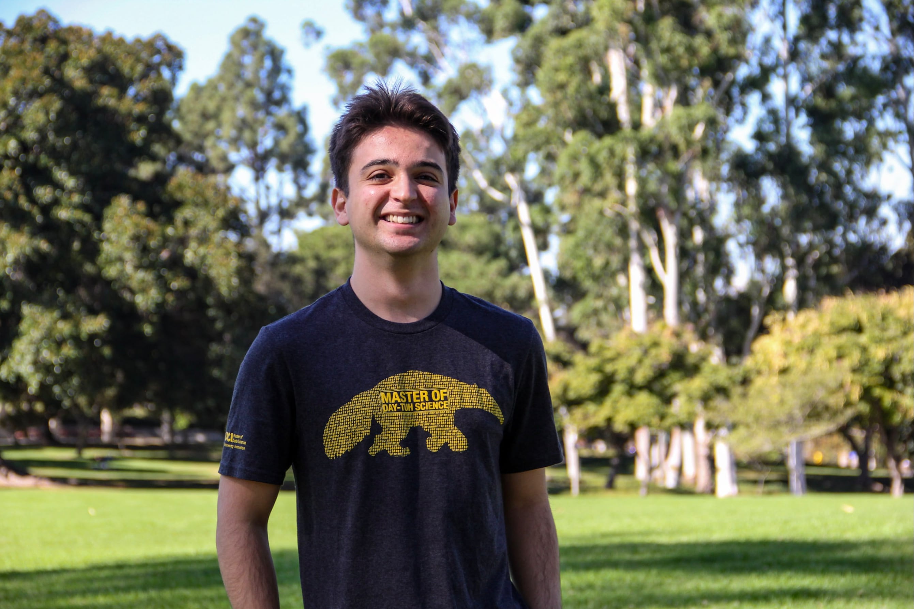
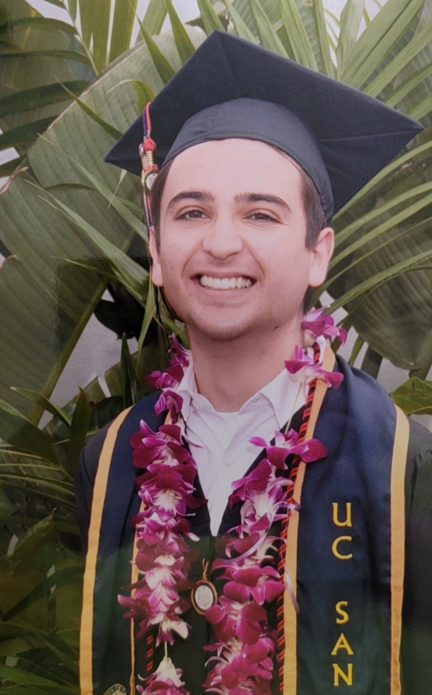
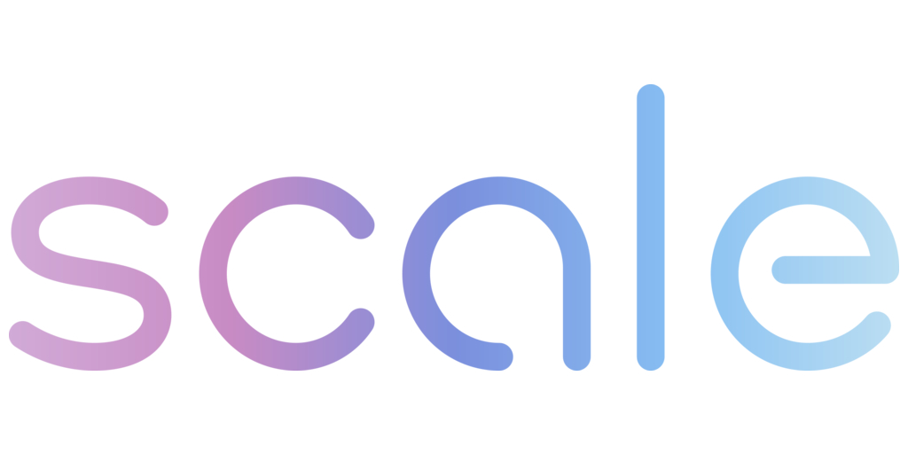
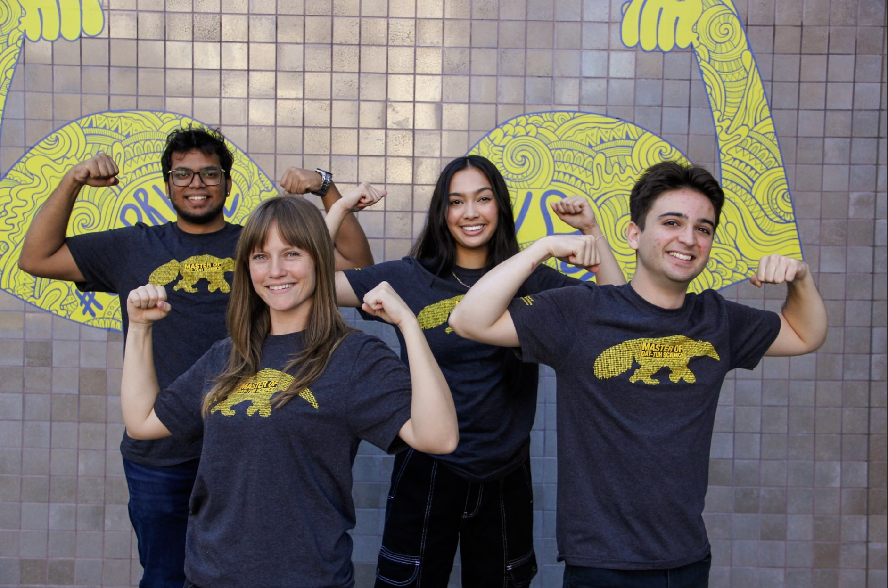

### About Me

At heart, I’ve always been a creative storyteller. I have fond memories of being that kid in the classroom that could not wait for writing hour, a time during which I knew I could explore the greatest depths of my imagination and convey these thoughts on a piece of paper. Often being one of the quietest people in my classes, I truly valued writing as a place where I could simply be _me_ and express _my_ thoughts without my social fears becoming too overwhelming. My love for sports also manifested during this time. I started playing and analyzing the sport of basketball at the age of 8. The art of **precision** and **decision-making** is what ultimately got me interested in the game. I found it so fascinating how much repetitive practice it took to obtain a satisfactory level of accuracy in regards to shooting and making a basket. I also appreciated the managerial side of the sport, such as coaches having to pinpoint specific rotational decisions and playcalls, or owners having to manage a specific salary budget in order to create a balanced and well-put-together roster. As both a player and a fan, I adored this type of analysis, and it's something that has simply been a part of me ever since then. Last but not least, technology was a huge fascination I held as a child. I was that kid that begged his parents for the newest iPod and Nintendo DS that hit the market. Even though I was often met with a denial, I would endlessly research how these devices worked, what their unique features were, and why they were, in the eyes of a kid, simply revolutionary. I viewed these devices as items that would make mine and so many other lives easier and more enjoyable.

Time went on and, before I knew it, it was time to embark on my collegiate journey and turn my passions into a career. However, I had no idea how to blend my interests into one entity. I eventually decided to take the “easy” way out and began my undergraduate years at UC San Diego as an English major. I quickly realized this was not for me, as that field did not encapsulate all of my passions and occupational goals in the long run. I felt like I was at a loss, until I discovered the fields of Cognitive Science and Data Science. I had finally found my niche. I could explore the cognition behind decision-making and why people think the way that they do. I would learn about the newest technologies like machine learning and artificial intelligence, and apply these tools to unique projects tailored towards my passions. And, arguably most important of all, I would continue to showcase my love for creativity and storytelling through my work. Graphical visualizations and analytical journals detailing my projects were only a couple of avenues that would take me back to being that kid who was eagerly waiting for writing hour in order to truly express himself. My undergraduate years are where I truly found myself, evidenced by how happy I was and how much I succeeded.

I always knew that I wanted to carry this success into graduate school, and am now continuing to hone and improve my data science skills as a Data Science Master’s student at UC Irvine. I’ve learned to love being presented with a unique challenge, working from the ground up to solve that challenge in an efficient manner, and piecing together my discoveries with that same **creative** magic and **precise** nature that I’ve held so deeply from a young age. My analytical mindset continues to coincide with my love for all sectors where decision-making, risk management, and pattern recognition is at the forefront of organizational importance. I plan to continue exploring these vast passions of mine throughout my time in this program and the start of my career, in addition to learning more invaluable skills through my coursework in order to sharpen my expertise within the field. As I continue to move towards graduating in December 2024, I find myself reflecting on the journey that has led me to this point. From the child who loved writing and playing basketball, to the tech enthusiast who dreamed of the latest gadgets, each of these experiences has shaped my approach to data science. They have given me a unique perspective, blending creativity with analytical rigor, and a passion for understanding complex systems, whether in sports, technology, or cognition. My journey has been unconventional, but it has equipped me with a diverse set of skills and insights that I believe are invaluable in this field. As I look towards the future, I am excited about the endless possibilities that await. I see myself not just as a data scientist, but as an innovator who uses data to tell stories, solve problems, and make impactful decisions.

### Education

I'm currently attending UC Irvine in their Master's of Data Science program. I will be graduating in December 2024. Before UC Irvine, I graduated from UC San Diego with a Bachelor's of Science in Machine Learning and Neural Computation, housed within their Cognitive Science department. While at UC San Diego, I also obtained a certification in Machine Learning Methods from their Extension program.

  
  

### Experience
#### **Scale AI - Generative Artificial Intelligence Prompt Engineer (May 2024 - Present)**
I started working for Scale AI as a freelance Gen AI Prompt Engineer in May 2024. My day-to-day work consists of editing, refining, and training open-source large language model (LLM) responses to enhance accuracy and coherence in real-time conversations. I've also had the opportunity to apply regression modeling to predict user satisfaction scores on a five-star scale from various conversation metrics, such as the overall sentiment of prompts given to the LLM. My favorite impactful moment at Scale was when I worked directly wiht OpenAI to analyze conversational datasets taken from real-world conversations their users had with ChatGPT. I leveraged clustering techniques, such as K-means and Hierarchical Agglomerative Clustering (HAC), to identify user patterns like query complexity, topic preferences, and interaction frequency. As a whole, the strategies I deployed informed GPT-model adjustments and improved response relevancy, generating new training data that will aid in improving future iterations of ChatGPT.

**Key Skills:** LLM Prompt Engineering, Regression Modeling, Sentiment Analysis, Clustering Techniques (K-means, HAC), Data Analysis, Machine Learning, Natural Language Processing

  

#### **MoodMe - Machine Learning Engineer & Co-Founder (December 2023 - Present)**
The highlight of my Data Science career thusfar has been being named a Co-Founder and Machine Learning Engineer for MoodMe, an innovative start-up company that focuses on emotional intelligence products for a wide-range of industries. I led the creation and implementation of machine learning models for unbiased emotion detection applications. More specifically, I love to tell others about my experience with developing a customized text emotion detection model (powered by a tuned version of Hugging Face's BERT) that would go on to be the backbone of our well-being diary application that helps users track and understand their emotional patterns over time. I also conducted a comprehensive benchmark of the company's face emotion, gender, age, and ethnicity detection models versus its competitors, and leveraged my analysis to enhance the in-house emotion model through techniques such as transfer learning and noise injection. This led to an immediate increase in performance across all platforms the model was deployed on!

**Key Skills:** Machine Learning Model Development, BERT Fine-tuning, Emotion Detection, Benchmarking, Transfer Learning, Noise Injection, Computer Vision, Natural Language Processing

  
  <a href="MoodMe Benchmarks Jan 2024.pptx-4.pdf" class="btn">View Competitive Analysis Presentation</a>
  <a href="https://www.mood-me.com" class="btn">Visit MoodMe Website</a>

#### **Donald Bren School of ICS - Master of Data Science Ambassador (October 2023 - Present)**
Throughout my time at UC Irvine, I worked as a Master of Data Science Ambassador for the MDS program. A perfect way to describe this role is "being a liaison for the current student." I supported the creation and development of ideas for marketing campaigns, answered questions from prospective students, and conducted internal analyses with my program director and fellow ambassadors. For example, I performed a time series analysis using R's `forecast` library and Python's `statsmodels` to track and predict trends in data science master's programs across the United States. I also completed a project that examined custom metrics across various tech-centric master's programs, such as transparency and flexibility scores, to determine where UC Irvine's MDS places amongst other programs. All bias aside, we were constantly ranked at the top of all my tests!

**Key Skills:** Time Series Analysis, R Programming, Python Programming, Data Visualization, Market Research, Program Analysis, Communication, Student Outreach

  

  
  <a href="Additional Program Analysis.html" class="btn">View Program Analysis Project</a>

#### **Sportradar US - Sports Data Operator** 
September 2022 - Present
- Attended NCAA/Pro sporting events (mens and women's basketball, baseball, men's and women's volleyball, soccer) and recorded game-related statistics (using company software).
- Communicated with supervisor on-site regarding the specifics of data.
- Successfully operated 230+ games with 5-star performance.

### Projects
#### Autoencoder Anomaly Analysis for NBA Players:
- Delved deeper into understanding the fluctuations in NBA player game-to-game performances, particularly focusing on Kobe Bryant's 2008-2009 season.
- Created an autoencoder model in an effort to uncover any non-linear relationships and nuances indicative of performance trends.
- Achieved 100% evaluation metrics (precision, recall, F1-score) when labeling Bryant's games as above or below average, potentially discovering factors that contributed to a range of performances. 

#### Advanced NBA Referee Analysis:
- Explored decision-making patterns of NBA referees to enhance fairness and integrity of the sport. Aimed to identify areas where officiating can be optimized.
- Engineered a 1410x23 data frame that utilized cleaned referee statistics. Created advanced neural network models (three FNNs and one CNN) for comprehensive analysis.
- Obtained 92% test accuracy through innovative CNN application, confirming the effectiveness of the approach in identifying patterns and areas of improvement in referee standards.

#### Predicting CCRB's Outcome on Civilian Complaints
- Addressed predicting officer remediation amid the complexity of police misconduct complaints.
- Extracted pivotal data features using the "Eli5" Python library, directing focus on variables affecting disciplinary outcomes. Developed and evaluated logistic regression, K-NN, Random Forests, and Gradient Boosting models (using F1-score).
- Unveiled logistic regression as the optimum predictive algorithm, enabling accurate forecasts of officer remediation outcomes.

#### R Case Study
- Investigated the prevailing trends in tobacco usage among American youth.
- Wrangled/analyzed a comprehensive CDC dataset and produced multiple visualization models to illuminate detailed patterns in youth tobacco and e-cigarette usage.
- Unveiled pivotal insights, such as the popularity of sweet-flavored vapes and a zero-sum relationship between e-cigarettes and traditional tobacco usage.

### Hobbies
